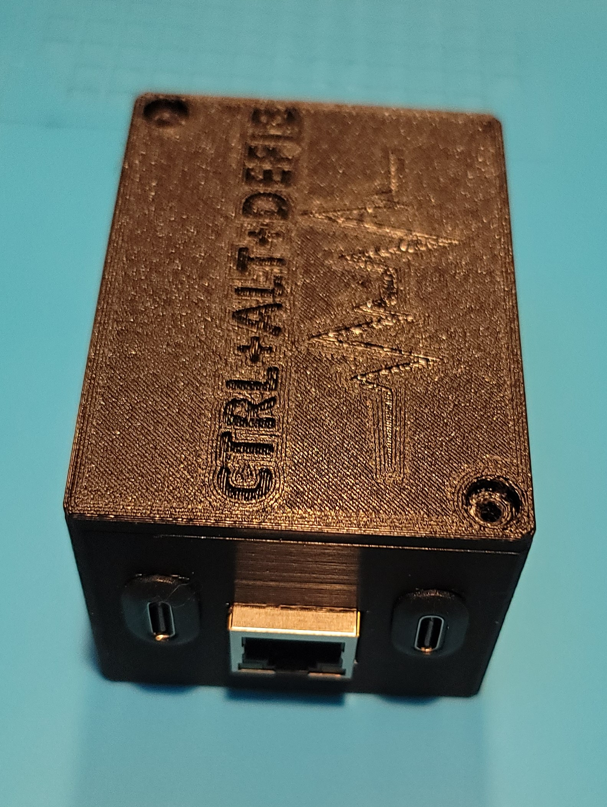
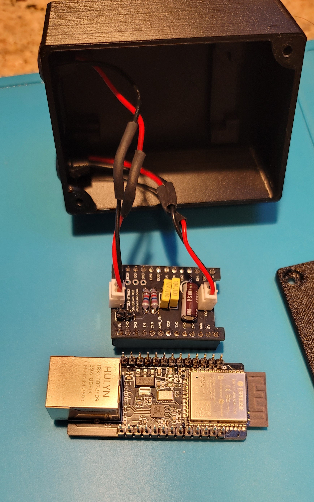
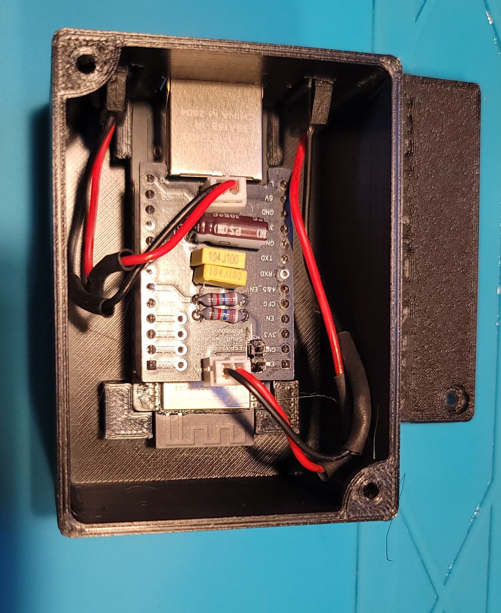
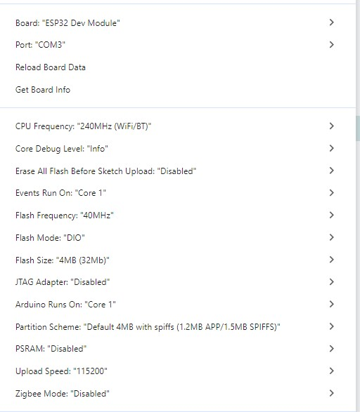
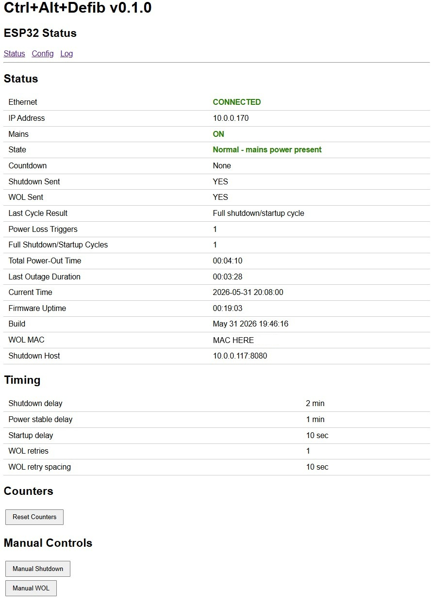
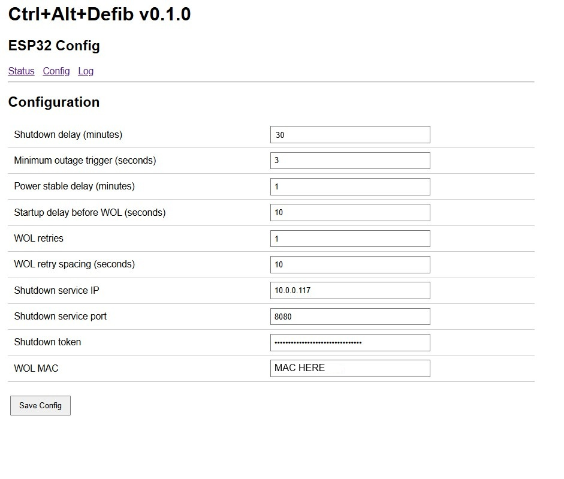
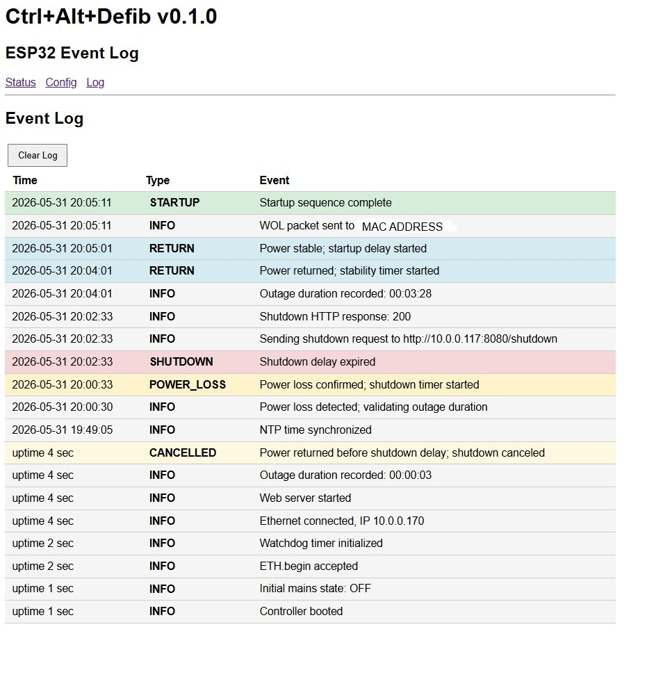

# Ctrl+Alt+Defib

**Ctrl+Alt+Defib** is an ESP32-based power outage monitoring and automated shutdown system designed for Proxmox servers.

The system monitors utility power using a standard 5V USB power adapter. When utility power is lost, a configurable shutdown timer begins. If power is not restored before the timer expires, the Ctrl+Alt+Defib unit sends a secure shutdown request to a Proxmox shutdown service running in a lightweight Linux container. The shutdown service then performs a controlled shutdown of the Proxmox host to protect virtual machines, containers, and storage from unexpected power loss before the UPS batteries are depleted.

The ESP32 remains powered by the UPS during an outage, allowing it to continue monitoring power status. When utility power is restored, a separate configurable startup timer begins. Once the startup delay has expired, the Ctrl+Alt+Defib unit automatically sends a Wake-on-LAN packet to restart the Proxmox host.

The project is designed to be simple to deploy, inexpensive to build, and easy to configure. All settings are managed through a built-in web interface hosted directly on the Ctrl+Alt+Defib unit.

---

## Features

* Configurable shutdown delay timer
* Web-based configuration interface
* Secure token-protected shutdown requests
* Automated Proxmox shutdown-service container installer
* Wake-on-LAN support for automatic Proxmox host startup after power restoration
* Local event logging and status monitoring
* Open-source hardware and firmware
* Designed and tested for the ESP32-ETH02 Ethernet module

---

## Repository Structure

```text
.
├── docs
│   └── images
│       ├── Arduino-IDE-Settings.jpg
│       ├── Case-End.jpg
│       ├── Case-esp32.jpg
│       ├── Case-inside.jpg
│       ├── Hat-schematic.png
│       ├── Hookup-Diagram.png
│       ├── PCB-hat.jpg
│       ├── Webpage-config.jpg
│       ├── Webpage-log.jpg
│       └── Webpage-status.jpg
├── enclosure
│   └── stl
│       ├── CtrlAltDefib Case Lid.stl
│       ├── CtrlAltDefib Case.stl
│       └── Printing-Notes.md
├── firmware
│   └── CtrlAltDefib
│       └── CtrlAltDefib.ino
├── hardware
│   └── CtrlAltDefib-HAT
│       ├── CtrlAltDefib-HAT-Gerbers.zip
│       ├── CtrlAltDefib-HAT-Schematic.pdf
│       └── README.md
├── LICENSE
├── README.md
└── shutdown-service
    └── install-shutdown-service.sh
```

---

## How It Works

1. The Ctrl+Alt+Defib unit is powered by the UPS so it remains operational during a power outage.
2. A standard 5V USB-C power adapter monitors the presence of utility power.
3. If utility power is lost, a configurable shutdown countdown begins.
4. If utility power returns before the timer expires, the shutdown countdown is cancelled.
5. If the timer expires, the Ctrl+Alt+Defib unit sends a secure shutdown request to the Proxmox shutdown service.
6. The shutdown service cleanly shuts down the Proxmox host.
7. When utility power is restored, a configurable startup countdown begins.
8. When the startup countdown expires, the Ctrl+Alt+Defib unit automatically sends a Wake-on-LAN packet to restart the Proxmox host.

<p align="center">
  
</p>

---

## Hardware

All hardware files required to build the project are located in the hardware/CtrlAltDefib-HAT directory.

The utility power sensing adapter must be connected to a non-UPS outlet. If it is connected to a UPS-backed outlet, the system will be unable to detect a utility power failure.

The Ctrl+Alt+Defib unit must remain powered during a utility power outage. This is typically accomplished using a UPS, but a suitable USB battery pack may also be used.

Network connectivity between the Ctrl+Alt+Defib unit and the Proxmox host must remain available during a power outage. If the Ctrl+Alt+Defib unit communicates through a network switch, the switch should also remain powered until the shutdown process is complete.

Failure to maintain power to the Ctrl+Alt+Defib unit or the network path will prevent the shutdown request from reaching the Proxmox host. 

---

## Assembled Unit

<p align="center">
  
  
  
</p>

---

### Included Files

* Bill of Materials (BOM)
* PCB design files
* Schematic files

Refer to the hardware README for the complete bill of materials, sourcing information, and assembly notes.

The 3D printable enclosure files are located in the `enclosure` directory.

### Programming the ESP32-ETH02

The ESP32-ETH02 does not include a built-in USB programming interface.

To upload firmware, you will need one of the following:

* An ESP32-ETH02 programming adapter board
* A USB-to-Serial adapter with access to the required programming pins

The easiest option is to use one of the ESP32-ETH02 programming adapter boards available from Amazon, AliExpress, and other suppliers. These adapter boards typically provide:

* USB-C connection
* USB-to-Serial interface
* BOOT button
* RESET button
* Power regulation

These adapters allow the ESP32-ETH02 to be programmed directly from the Arduino IDE over USB without additional wiring.

---

## Firmware Installation

The firmware has been developed and tested on the ESP32-ETH02 Ethernet module.

Other LAN8720-based ESP32 Ethernet boards may work, but they have not been tested with this project and are not currently supported.

Open the `CtrlAltDefib.ino` sketch located in:

```text
firmware/CtrlAltDefib/
```

and upload it to your ESP32-ETH02 using the Arduino IDE.

### Configure Web Interface Credentials

Before compiling and uploading the firmware, edit the following lines in `CtrlAltDefib.ino`:

```cpp
constexpr const char *UI_USERNAME = "admin";
constexpr const char *UI_PASSWORD = "CHANGE-ME";
```

Change the password to a secure value before uploading the firmware.

Example:

```cpp
constexpr const char *UI_USERNAME = "admin";
constexpr const char *UI_PASSWORD = "MySecurePassword";
```

The web interface will use these credentials for authentication.

---


### Install ESP32 Board Support

Before compiling the firmware, install the ESP32 board package using the Arduino IDE Board Manager.

1. Open **Tools → Board → Boards Manager**.
2. Search for:

ESP32

3. Install the ESP32 package published by Espressif Systems.

After installation, select:

Tools → Board → ESP32 Arduino → ESP32 Dev Module

and configure the settings shown below.

### Arduino IDE Settings

The firmware was developed and tested using the following Arduino IDE settings:

| Setting                              | Value                                            |
| ------------------------------------ | ------------------------------------------------ |
| Board                                | ESP32 Dev Module                                 |
| CPU Frequency                        | 240MHz (WiFi/BT)                                 |
| Core Debug Level                     | Info                                             |
| Erase All Flash Before Sketch Upload | Disabled                                         |
| Events Run On                        | Core 1                                           |
| Flash Frequency                      | 40MHz                                            |
| Flash Mode                           | DIO                                              |
| Flash Size                           | 4MB (32Mb)                                       |
| JTAG Adapter                         | Disabled                                         |
| Arduino Runs On                      | Core 1                                           |
| Partition Scheme                     | Default 4MB with spiffs (1.2MB APP/1.5MB SPIFFS) |
| PSRAM                                | Disabled                                         |
| Upload Speed                         | 115200                                           |
| Zigbee Mode                          | Disabled                                         |

<p align="center">
  
</p>

### Uploading the Firmware

1. Connect the ESP32-ETH02 to your programming adapter.
2. Connect the programming adapter to your computer using USB.
3. Open `firmware/CtrlAltDefib/CtrlAltDefib.ino` in the Arduino IDE.
4. Configure the username and password in the sketch before compiling.
5. Select the settings listed above.
6. Compile and upload the firmware.

### Required Libraries

Install any required libraries when prompted by the Arduino IDE.

After the firmware has been uploaded successfully, continue with the Proxmox Shutdown Service Setup section.

---

## Proxmox Shutdown Service Setup

The shutdown service runs inside a lightweight Debian LXC container and receives authenticated shutdown requests from the ESP32.

The installer automatically creates and configures the container, installs all required software, generates SSH keys, and configures the shutdown service.

### Prerequisites

* Proxmox VE 8.x or newer
* Internet access from the Proxmox host
* A Debian 12 container template available in Proxmox

If a Debian 12 template is not already installed:

1. Open the Proxmox web interface.
2. Select the local storage.
3. Open **CT Templates**.
4. Download the latest **Debian 12 Standard** template.

### Download the Repository

Log in to the Proxmox host as root and clone the repository:

```bash
git clone https://github.com/shaneaune/CtrlAltDefib.git
cd CtrlAltDefib/shutdown-service
```

### Run the Installer

Make the installer executable and start it:

```bash
chmod +x install-shutdown-service.sh
./install-shutdown-service.sh
```

The installer will:

* Create the shutdown-service container
* Install required packages
* Generate the SSH shutdown key
* Install and start the shutdown service
* Display the ESP32 configuration settings
* Generate the authorized_keys entry required for Proxmox shutdown access

### Complete the Action Required Step

When the installer completes, it will display a line similar to:

```text
command="shutdown -h now",no-port-forwarding,no-agent-forwarding,no-pty ssh-ed25519 ...
```

Copy the entire line and add it to the Proxmox host's authorized_keys file:

```bash
nano /root/.ssh/authorized_keys
```

Paste the generated line onto a new line at the end of the file.

To save the file:

Ctrl+O
Enter

To exit Nano:

Ctrl+X

On the Proxmox host you can retrieve the generated line again at any time with:

```bash
pct exec <CTID> -- cat /root/proxmox_authorized_key.txt
```

---

### Record the ESP32 Settings

The installer will display:

* Shutdown Service IP
* Shutdown Service Port
* Shutdown Token

These values will be required when configuring the Ctrl+Alt+Defib web interface.

---

## First Shutdown Test Preparation

The first time the shutdown-service container connects to the Proxmox host, SSH will prompt to verify the Proxmox host key.

Before performing the first shutdown test:

1. Open a console to the shutdown-service container.

2. Run:

pct enter <CTID>

3. Leave the console open during the first shutdown test.

When the shutdown timer expires, you will see a message similar to:

The authenticity of host '10.0.0.xxx' can't be established.
ED25519 key fingerprint is SHA256:xxxxxxxxxxxxxxxxxxxxxxxxxxxx.
Are you sure you want to continue connecting (yes/no/[fingerprint])?

Type:

yes

and press Enter.

The Proxmox host key will be saved and all future shutdowns will occur automatically without additional user interaction.


### First Shutdown Test

After the Ctrl+Alt+Defib unit has been configured, perform a shutdown test.

The first shutdown request will automatically save the Proxmox host SSH key within the shutdown-service container. Future shutdown requests will use the saved key automatically.

Verify that:

* The ESP32 detects utility power loss
* The shutdown timer expires as expected
* The Proxmox host shuts down cleanly
* Wake-on-LAN startup functions correctly after power restoration

> **Note:** During the first shutdown test only, you may be prompted to verify the Proxmox host SSH key as described in the previous section.

---

## ESP32 Configuration

After uploading the firmware and connecting the Ctrl+Alt+Defib unit to your network, the device will automatically obtain an IP address using DHCP.

Locate the assigned IP address using your router, DHCP server, or a network scanning tool and open the web interface in your browser:

```text
http://<ip-address>/
```

### Log In

Log in using the username and password configured in the firmware before uploading.

After logging in, the Status page will be displayed. Open the **Configuration** page to access the system settings.

### Configure the Shutdown Service

On the Configuration page, enter the values provided by the shutdown-service installer:

* Shutdown Service IP Address
* Shutdown Service Port
* Shutdown Token

### Configure Shutdown Settings

Set the desired shutdown delay. This determines how long the system will wait after utility power is lost before initiating a Proxmox shutdown.

### Configure Wake-on-LAN

Enter the MAC address of the Proxmox host and configure the desired startup delay.

When utility power is restored, the ESP32 will wait for the configured startup delay before sending the Wake-on-LAN packet.

### Save Settings

Save the configuration using the web interface. The Ctrl+Alt+Defib unit will begin monitoring utility power and managing shutdown and startup events using the configured settings.

<p align="center">
  
  
  
</p>

---

## First Shutdown Test

Before relying on Ctrl+Alt+Defib to protect your Proxmox host, perform a complete functional test.

### Verify Power Detection

1. Ensure the Ctrl+Alt+Defib unit is powered from a UPS-backed outlet.
2. Ensure the utility power sensing adapter is connected to a non-UPS outlet.
3. Open the Ctrl+Alt+Defib Status page.
4. Verify that utility power is reported as present.

### Verify Shutdown Operation

1. Temporarily disconnect the utility power sensing adapter.
2. Verify that the shutdown countdown begins.
3. Allow the countdown to expire.
4. Confirm that the Proxmox host shuts down cleanly.

### Verify Startup Operation

1. Restore utility power.
2. Verify that the startup countdown begins.
3. Allow the startup delay to expire.
4. Confirm that a Wake-on-LAN packet is sent.
5. Verify that the Proxmox host powers on successfully.

### Verify System Status

After the test is complete, confirm that:

* Utility power status is reported correctly.
* Shutdown countdown operates correctly.
* Startup countdown operates correctly.
* The Proxmox host shuts down cleanly.
* Wake-on-LAN startup functions correctly.
* Event logs show the expected activity.

Once these checks have been completed successfully, the system is ready for normal operation.
---

